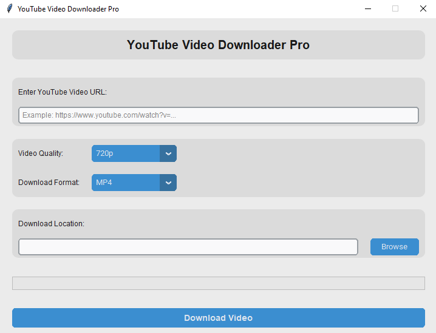

# Pytube-pro
Pytube Pro is a Python-based video downloader for YouTube featuring a sleek graphical user interface.  
It allows users to download videos in various formats and resolutions easily and efficiently.

Features

- Supports multiple video formats and resolutions  
- User-friendly GUI for effortless video downloading  
- Fast and reliable performance  
- Cross-platform compatibility (Windows, macOS, Linux)

Requirements

- Python 3.6 or higher  
- Required libraries listed in `requirements.txt`

License

Licensed under the MIT License.

If you enjoy what I do, consider supporting me on Ko-fi! Every little bit means the world! https://ko-fi.com/silentecho_platfom
